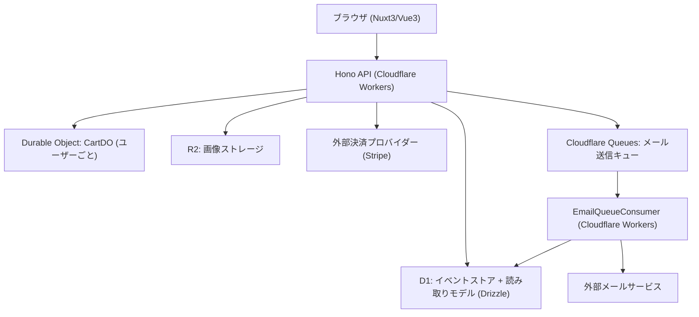
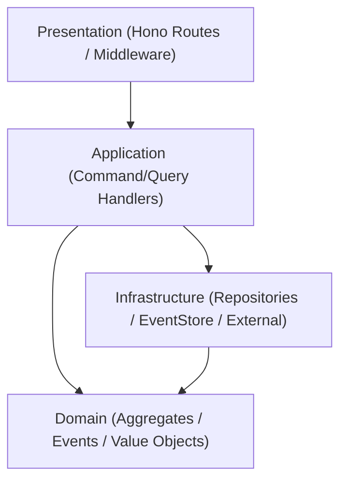
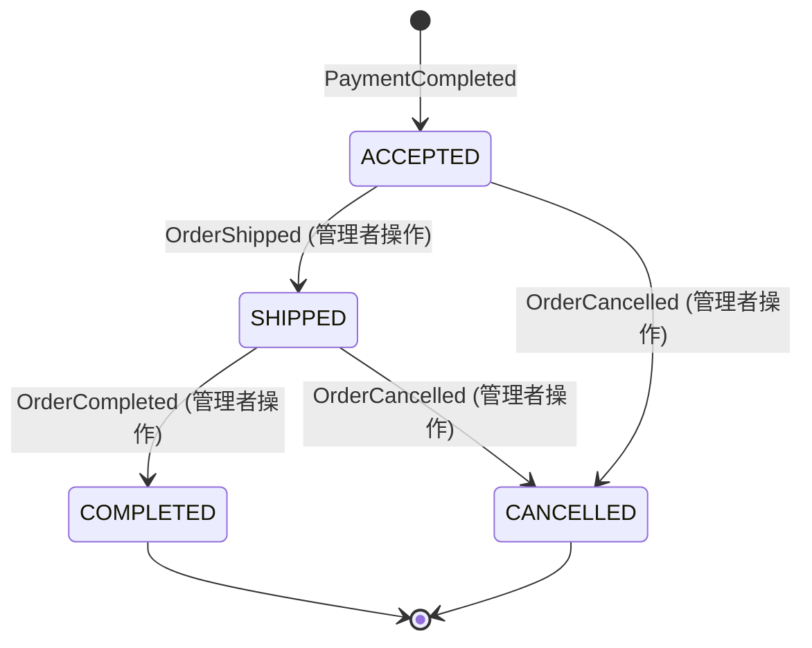

# ECサイト 技術設計

## 概要

| 項目 | 内容 |
|------|------|
| 目的 | Cloudflare プラットフォーム上に EC サイトを構築する |
| 対象ユーザー | 顧客（購買・アカウント管理）、管理者（商品・注文・顧客管理） |
| 影響範囲 | 新規プロジェクト。既存コードへの影響なし |
| 実装コンテキスト | 既存実装なし。全コンポーネントを新規作成 |

---

## アーキテクチャ

### パターン

| パターン | 採用方針 |
|----------|---------|
| Onion Architecture | Domain → Application → Infrastructure の依存方向を厳守 |
| CQRS | Command（書き込み）と Query（読み取り）を分離 |
| Event Sourcing | 状態変更はすべてイベントとして D1 に追記。集約はイベント再生で復元 |
| Always Valid Domain Model | 集約は常に有効な状態のみ受け入れる。不正状態は型で表現しない |
| Functional / Immutable | 集約・値オブジェクトはすべて readonly。変更は新オブジェクトを返す |
| Vertical Slice | Application 層はフィーチャー単位（product / order / user / category / wishlist）で分割 |

### 境界マップ



### レイヤー依存方向



### 技術スタック

| 区分 | 技術 |
|------|------|
| バックエンド実行環境 | Cloudflare Workers |
| HTTPフレームワーク | Hono |
| ORM | Drizzle (drizzle-orm/d1) |
| スキーマ検証 | Zod v4（全層） |
| データストア | Cloudflare D1（SQLite互換）|
| カート状態 | Cloudflare Durable Objects |
| 画像ストレージ | Cloudflare R2 |
| フロントエンド | Nuxt3 / Vue3 |
| 開発環境 | mise |

### データフロー

**Write Path (Command)**
```
HTTP Request → Hono Router → Zod Validation → AuthMiddleware
→ CommandHandler → [集約をイベント再生で復元]
→ ドメインロジック実行 → ドメインイベント生成
→ EventStore.append() (楽観的ロック: UNIQUE(aggregate_id, version))
→ Projection更新（同期） → HTTP Response
```

**Email Path（メール送信・再送）**
```
CommandHandler（注文確定後）→ Cloudflare Queues.send(EmailMessage)
→ [Workers ctx.waitUntil でエンキュー]
→ EmailQueueConsumer（別 Worker）→ EmailService.send()
  成功: 完了
  失敗: 再試行カウンター更新（D1）→ 残試行回数 > 0 → Queues.send() に再エンキュー（30分遅延）
       残試行回数 = 0 → エラーログ記録（要件7.4）
```

**Read Path (Query)**
```
HTTP Request → Hono Router → AuthMiddleware（任意）
→ QueryHandler → Drizzle/D1 読み取りモデルクエリ → HTTP Response
```

**Cart Path (Durable Object)**
```
HTTP Request → Hono Router → AuthMiddleware
→ CartDO stub 取得 → CartDO.fetch() → 在庫確認（D1）→ カート更新 → HTTP Response
```

---

## コンポーネントとインターフェース

### コンポーネント一覧

| コンポーネント | 層 | 責務 |
|---|---|---|
| Product | Domain | 商品の状態・在庫ルール・価格バリデーション |
| Order | Domain | 注文ライフサイクル・ステータス遷移ルール |
| User | Domain | ユーザー認証・アカウントロック・パスワード管理 |
| Category | Domain | カテゴリ名一意性・削除制約 |
| CartDO | Infrastructure | カート操作・在庫確認（Durable Object） |
| EventStore | Infrastructure | イベント追記・楽観的ロック（バージョン管理） |
| ProductReadRepository | Infrastructure | 商品読み取りモデルクエリ（Drizzle/D1） |
| OrderReadRepository | Infrastructure | 注文読み取りモデルクエリ（Drizzle/D1） |
| UserRepository | Infrastructure | ユーザーデータアクセス（Drizzle/D1） |
| AddressRepository | Infrastructure | 住所帳データアクセス（Drizzle/D1） |
| WishlistRepository | Infrastructure | ウィッシュリストデータアクセス（Drizzle/D1） |
| CategoryRepository | Infrastructure | カテゴリデータアクセス（Drizzle/D1） |
| PaymentGateway | Infrastructure | 外部決済プロバイダー抽象化インターフェース |
| EmailService | Infrastructure | メール送信インターフェース（Resend / SendGrid） |
| EmailQueueConsumer | Infrastructure | Cloudflare Queues からメッセージ受信・再試行付きメール送信 |
| EmailRetryRepository | Infrastructure | メール再送試行回数の永続化（D1） |
| ImageRepository | Infrastructure | R2 画像保存・公開URL返却 |
| ProjectionService | Infrastructure | ドメインイベント → 読み取りモデル更新（同期） |
| JwtService | Infrastructure | JWT生成・検証（アクセストークン・リフレッシュトークン） |
| ProductCommandHandlers | Application | 商品CRUDコマンド処理（CreateProduct, UpdateProduct, DeleteProduct） |
| StockCommandHandlers | Application | 在庫更新コマンド処理（UpdateStock） |
| CategoryCommandHandlers | Application | カテゴリCRUDコマンド処理（CreateCategory, DeleteCategory） |
| ImageCommandHandlers | Application | 画像アップロード・関連付けコマンド処理（UploadImage, AssociateProductImage） |
| ProductQueryHandlers | Application | 商品・カテゴリ一覧・詳細クエリ処理 |
| OrderCommandHandlers | Application | 注文確定・ステータス更新・キャンセル・返金コマンド処理 |
| OrderQueryHandlers | Application | 注文一覧・詳細クエリ処理 |
| AuthCommandHandlers | Application | 認証コマンド処理（Register, Login, Logout, VerifyEmail, RefreshToken, RequestPasswordReset, ConfirmPasswordReset） |
| AddressCommandHandlers | Application | 住所帳コマンド処理（AddAddress, UpdateAddress, DeleteAddress） |
| WishlistCommandHandlers | Application | ウィッシュリストコマンド処理（AddToWishlist, RemoveFromWishlist） |
| AddressQueryHandlers | Application | 住所一覧クエリ処理（ListAddresses） |
| WishlistQueryHandlers | Application | ウィッシュリスト一覧クエリ処理（GetWishlist） |
| CustomerQueryHandlers | Application | 会員一覧・詳細クエリ処理（ListCustomers, GetCustomerDetail） |
| AuthMiddleware | Presentation | JWT検証・ロール認可（CUSTOMER / ADMIN） |
| CustomerRoutes | Presentation | 顧客向け HTTP エンドポイント（Hono） |
| AdminRoutes | Presentation | 管理者向け HTTP エンドポイント（Hono） |

### ディレクトリ構造

```
apps/
├── api/                              # Hono バックエンド（Workers）
│   ├── src/
│   │   ├── domain/
│   │   │   ├── shared/
│   │   │   │   ├── ValueObjects.ts   # ProductId, UserId, OrderId, Email, Price
│   │   │   │   └── DomainEvent.ts    # イベントエンベロープ型
│   │   │   ├── product/
│   │   │   │   ├── Product.ts        # Aggregate
│   │   │   │   └── ProductEvents.ts  # 判別共用体（ProductCreated等）
│   │   │   ├── order/
│   │   │   │   ├── Order.ts
│   │   │   │   └── OrderEvents.ts
│   │   │   ├── user/
│   │   │   │   ├── User.ts
│   │   │   │   └── UserEvents.ts
│   │   │   └── category/
│   │   │       └── Category.ts
│   │   ├── application/
│   │   │   ├── product/
│   │   │   │   ├── commands/
│   │   │   │   │   ├── ProductCommandHandlers.ts  # CreateProduct, UpdateProduct, DeleteProduct
│   │   │   │   │   ├── StockCommandHandlers.ts    # UpdateStock
│   │   │   │   │   ├── CategoryCommandHandlers.ts # CreateCategory, DeleteCategory
│   │   │   │   │   └── ImageCommandHandlers.ts    # UploadImage, AssociateProductImage
│   │   │   │   └── queries/          # ListProducts, GetProduct, ListCategories
│   │   │   ├── order/
│   │   │   │   ├── commands/         # PlaceOrder, UpdateOrderStatus,
│   │   │   │   │                     # CancelOrder, RefundOrder
│   │   │   │   └── queries/          # ListOrders, GetOrder, ListAdminOrders
│   │   │   └── user/
│   │   │       ├── commands/
│   │   │       │   ├── AuthCommandHandlers.ts    # Register, Login, Logout, VerifyEmail,
│   │   │       │   │                             # RefreshToken, RequestPasswordReset,
│   │   │       │   │                             # ConfirmPasswordReset
│   │   │       │   ├── AddressCommandHandlers.ts # AddAddress, UpdateAddress, DeleteAddress
│   │   │       │   └── WishlistCommandHandlers.ts # AddToWishlist, RemoveFromWishlist
│   │   │       └── queries/
│   │   │           ├── AddressQueryHandlers.ts   # ListAddresses
│   │   │           ├── WishlistQueryHandlers.ts  # GetWishlist
│   │   │           └── CustomerQueryHandlers.ts  # ListCustomers, GetCustomerDetail
│   │   ├── infrastructure/
│   │   │   ├── event-store/
│   │   │   │   └── D1EventStore.ts   # D1 イベントストア実装
│   │   │   ├── projection/
│   │   │   │   ├── ProductProjection.ts
│   │   │   │   ├── OrderProjection.ts
│   │   │   │   └── UserProjection.ts
│   │   │   ├── repository/
│   │   │   │   ├── DrizzleProductRepository.ts
│   │   │   │   ├── DrizzleOrderRepository.ts
│   │   │   │   ├── DrizzleUserRepository.ts
│   │   │   │   ├── DrizzleCategoryRepository.ts
│   │   │   │   ├── DrizzleWishlistRepository.ts
│   │   │   │   └── DrizzleAddressRepository.ts
│   │   │   ├── payment/
│   │   │   │   ├── PaymentGateway.ts  # インターフェース
│   │   │   │   └── StripePaymentGateway.ts
│   │   │   ├── email/
│   │   │   │   ├── EmailService.ts         # インターフェース
│   │   │   │   ├── ResendEmailService.ts
│   │   │   │   ├── EmailQueueConsumer.ts   # Queues コンシューマー（再試行ロジック含む）
│   │   │   │   └── EmailRetryRepository.ts # 再送試行回数管理（Drizzle/D1）
│   │   │   ├── image/
│   │   │   │   └── R2ImageRepository.ts
│   │   │   └── auth/
│   │   │       └── JwtService.ts
│   │   ├── presentation/
│   │   │   ├── routes/
│   │   │   │   ├── customer/
│   │   │   │   │   ├── products.ts   # GET /products, GET /products/:id
│   │   │   │   │   ├── cart.ts       # GET/POST/PUT/DELETE /cart
│   │   │   │   │   ├── checkout.ts   # POST /checkout
│   │   │   │   │   ├── orders.ts     # GET /orders, GET /orders/:id
│   │   │   │   │   ├── wishlist.ts   # GET/POST/DELETE /wishlist
│   │   │   │   │   ├── addresses.ts  # CRUD /addresses
│   │   │   │   │   └── auth.ts       # POST /auth/*
│   │   │   │   └── admin/
│   │   │   │       ├── products.ts   # CRUD /admin/products, stock, images
│   │   │   │       ├── categories.ts # CRUD /admin/categories
│   │   │   │       ├── orders.ts     # GET/PUT /admin/orders
│   │   │   │       ├── customers.ts  # GET /admin/customers
│   │   │   │       └── images.ts     # POST /admin/images
│   │   │   └── middleware/
│   │   │       ├── auth.ts           # JWT検証
│   │   │       ├── adminAuth.ts      # ADMINロール確認
│   │   │       └── errorHandler.ts   # グローバルエラーハンドラー
│   │   └── worker.ts                 # Workers エントリーポイント
│   ├── db/
│   │   ├── schema.ts                 # Drizzle スキーマ定義
│   │   └── migrations/
│   └── wrangler.toml
├── cart-do/
│   └── CartDurableObject.ts          # Cart Durable Object
└── web/                              # Nuxt3 フロントエンド
    ├── pages/
    │   ├── index.vue                 # 商品一覧
    │   ├── products/[id].vue         # 商品詳細
    │   ├── cart.vue
    │   ├── checkout.vue
    │   ├── orders/index.vue
    │   ├── orders/[id].vue
    │   ├── wishlist.vue
    │   ├── account/addresses.vue
    │   ├── auth/login.vue
    │   ├── auth/register.vue
    │   ├── auth/reset-password.vue
    │   └── admin/
    ├── composables/
    │   ├── useAuth.ts
    │   ├── useCart.ts
    │   └── useProducts.ts
    └── stores/
        ├── auth.ts                   # Pinia: 認証状態
        ├── cart.ts                   # Pinia: カート状態
        └── wishlist.ts               # Pinia: ウィッシュリスト状態
```

### 主要インターフェース定義

#### EventStore

```typescript
interface EventStore {
  append(
    aggregateId: string,
    aggregateType: string,
    events: readonly DomainEventPayload[],
    expectedVersion: number
  ): Promise<void>;  // VERSION_CONFLICT on version mismatch

  loadEvents(aggregateId: string): Promise<readonly StoredEvent[]>;
}
```

#### PaymentGateway

```typescript
interface PaymentGateway {
  chargeCreditCard(params: CreditCardChargeParams): Promise<ChargeResult>;
  issueConvenienceStorePayment(params: ConvStoreParams): Promise<ConvStoreResult>;
  refund(transactionId: string, amount: number): Promise<RefundResult>;
  voidConvenienceStorePayment(paymentCode: string): Promise<void>;
}
```

#### EmailService

```typescript
interface EmailService {
  sendOrderConfirmation(params: OrderConfirmationParams): Promise<void>;
  sendPasswordReset(params: PasswordResetParams): Promise<void>;
  sendRefundNotification(params: RefundNotificationParams): Promise<void>;
  sendEmailVerification(params: EmailVerificationParams): Promise<void>;
}
```

#### ImageRepository

```typescript
interface ImageRepository {
  upload(file: ArrayBuffer, contentType: string, key: string): Promise<string>;  // returns public URL
}
```

#### EmailQueueProducer

```typescript
interface EmailQueueProducer {
  enqueueOrderConfirmation(params: OrderConfirmationParams): Promise<void>;
  enqueueRefundNotification(params: RefundNotificationParams): Promise<void>;
}
```

#### ProjectionService（投影責務の明記）

**設計原則: `users` テーブルの書き込み管理**

`users` テーブルへの初期 INSERT は `AuthCommandHandlers` が `UserRepository.save()` を通じて直接書き込む（ハイブリッド方式）。これにより `UserRegistered` イベントのペイロードに `passwordHash` 等の認証資格情報を含める必要をなくし、イベントストアへの機密情報の永続化を回避する。

`EmailVerified` イベントによる `email_verified` フラグ更新のみ ProjectionService を経由する。

| イベント | 更新対象テーブル | 更新カラム |
|---------|--------------|---------|
| `ProductCreated` | `products_rm` | 全カラム（INSERT） |
| `ProductUpdated` | `products_rm` | 変更フィールド + `updated_at` |
| `ProductDeleted` | `products_rm` | `status = 'UNPUBLISHED'`, `updated_at` |
| `StockUpdated` / `StockDecreased` / `StockIncreased` | `products_rm` | `stock`, `stock_status`, `updated_at` |
| `ProductImageAssociated` | `products_rm` | `image_urls`（JSON append）, `updated_at` |
| `OrderCreated` | `orders_rm` | 全カラム（INSERT）|
| `PaymentCompleted` | `orders_rm` | `status = 'ACCEPTED'`, `updated_at` |
| `ConvenienceStorePaymentIssued` | `orders_rm` | `payment_code`, `payment_expires_at`, `updated_at` |
| `OrderShipped` | `orders_rm` | `status = 'SHIPPED'`, `updated_at` |
| `OrderCompleted` | `orders_rm` | `status = 'COMPLETED'`, `updated_at` |
| `OrderCancelled` | `orders_rm` | `status = 'CANCELLED'`, `updated_at` |
| `EmailVerified` | `users` | `email_verified = 1`, `updated_at` |

---

## データモデル

### ドメインモデル

#### 値オブジェクト

| 型名 | 不変条件 |
|------|---------|
| `ProductId` | UUID形式 |
| `OrderId` | UUID形式 |
| `UserId` | UUID形式 |
| `CategoryId` | UUID形式 |
| `Email` | RFC5322準拠のメールアドレス形式 |
| `Price` | 整数（円）。0以上 |
| `StockCount` | 整数。0以上 |

#### 集約

**Product Aggregate**

```typescript
type ProductStatus = "PUBLISHED" | "UNPUBLISHED";
type StockStatus = "IN_STOCK" | "OUT_OF_STOCK";

type Product = {
  readonly id: ProductId;
  readonly name: string;
  readonly description: string;
  readonly price: Price;
  readonly categoryId: CategoryId;
  readonly stock: StockCount;
  readonly stockStatus: StockStatus;
  readonly status: ProductStatus;
  readonly imageUrls: readonly string[];
  readonly version: number;
};
```

**Order Aggregate**

```typescript
type OrderStatus = "ACCEPTED" | "SHIPPED" | "COMPLETED" | "CANCELLED";
type PaymentMethod = "CREDIT_CARD" | "CONVENIENCE_STORE" | "CASH_ON_DELIVERY";

type OrderItem = {
  readonly productId: ProductId;
  readonly productName: string;
  readonly unitPrice: Price;
  readonly quantity: StockCount;
  readonly subtotal: number;
};

type ShippingAddress = {
  readonly postalCode: string;
  readonly prefecture: string;
  readonly city: string;
  readonly street: string;
  readonly recipientName: string;
  readonly phone: string;
};

type Order = {
  readonly id: OrderId;
  readonly customerId: UserId;
  readonly items: readonly OrderItem[];
  readonly shippingAddress: ShippingAddress;
  readonly paymentMethod: PaymentMethod;
  readonly subtotal: number;
  readonly shippingFee: number;
  readonly total: number;
  readonly status: OrderStatus;
  readonly version: number;
};
```

**User Aggregate**

```typescript
type UserRole = "CUSTOMER" | "ADMIN";

type User = {
  readonly id: UserId;
  readonly email: Email;
  readonly passwordHash: string;
  readonly name: string;
  readonly role: UserRole;
  readonly emailVerified: boolean;
  readonly failedLoginAttempts: number;
  readonly lockedUntil: Date | null;
  readonly version: number;
};
```

#### ドメインイベント（判別共用体）

**Product Events**

```typescript
type ProductEvent =
  | { type: "ProductCreated"; productId: string; name: string; description: string; price: number; categoryId: string; stock: number }
  | { type: "ProductUpdated"; productId: string; changes: Partial<{ name: string; description: string; price: number; categoryId: string }> }
  | { type: "ProductDeleted"; productId: string }
  | { type: "StockUpdated"; productId: string; quantity: number }
  | { type: "StockDecreased"; productId: string; quantity: number; orderId: string }
  | { type: "StockIncreased"; productId: string; quantity: number; orderId: string }
  | { type: "ProductImageAssociated"; productId: string; imageUrl: string };
```

**Order Events**

```typescript
type OrderEvent =
  | { type: "OrderCreated"; orderId: string; customerId: string; items: readonly OrderItemData[]; shippingAddress: ShippingAddress; paymentMethod: PaymentMethod; subtotal: number; shippingFee: number; total: number }
  | { type: "PaymentCompleted"; orderId: string; paymentMethod: PaymentMethod; transactionId: string }
  | { type: "ConvenienceStorePaymentIssued"; orderId: string; paymentCode: string; expiresAt: string }
  | { type: "OrderShipped"; orderId: string }
  | { type: "OrderCompleted"; orderId: string }
  | { type: "OrderCancelled"; orderId: string; reason: string }
  | { type: "RefundCompleted"; orderId: string; amount: number };
```

**User Events**

**設計原則: セキュリティトークンはイベントストアに含めない**

パスワードリセットトークン・メールアドレス確認トークンは一時的な認証資格情報であり、イミュータブルなイベントストアに永続化すると有効期限後もトークンが残存しセキュリティリスクとなる。`CommandHandler` が各トークンテーブル（`password_reset_tokens` / `email_verification_tokens`）に直接書き込む。イベントストアにはビジネス上の事実（「パスワードリセットが要求された」）のみを記録する。

```typescript
type UserEvent =
  | { type: "UserRegistered"; userId: string; email: string; name: string }
  | { type: "EmailVerified"; userId: string }
  | { type: "PasswordResetRequested"; userId: string }
  | { type: "PasswordReset"; userId: string }
  | { type: "LoginFailed"; userId: string }
  | { type: "AccountLocked"; userId: string; lockedUntil: string }
  | { type: "AccountUnlocked"; userId: string };
```

### 論理データモデル（D1/SQLite）

#### イベントストア

```sql
CREATE TABLE domain_events (
  id             TEXT    NOT NULL PRIMARY KEY,
  aggregate_type TEXT    NOT NULL,
  aggregate_id   TEXT    NOT NULL,
  version        INTEGER NOT NULL,
  event_type     TEXT    NOT NULL,
  payload        TEXT    NOT NULL,         -- JSON
  created_at     TEXT    NOT NULL,
  UNIQUE (aggregate_id, version)            -- 楽観的ロック
);
CREATE INDEX idx_events_aggregate ON domain_events (aggregate_id, version);
```

#### 読み取りモデル

```sql
CREATE TABLE products_rm (
  id           TEXT    NOT NULL PRIMARY KEY,
  name         TEXT    NOT NULL,
  description  TEXT    NOT NULL,
  price        INTEGER NOT NULL,
  category_id  TEXT    NOT NULL,
  stock        INTEGER NOT NULL DEFAULT 0,
  stock_status TEXT    NOT NULL DEFAULT 'IN_STOCK',   -- IN_STOCK | OUT_OF_STOCK
  status       TEXT    NOT NULL DEFAULT 'PUBLISHED',  -- PUBLISHED | UNPUBLISHED
  image_urls   TEXT    NOT NULL DEFAULT '[]',         -- JSON array
  created_at   TEXT    NOT NULL,
  updated_at   TEXT    NOT NULL
);
CREATE INDEX idx_products_category ON products_rm (category_id);
CREATE INDEX idx_products_status   ON products_rm (status);
CREATE INDEX idx_products_price    ON products_rm (price);

CREATE TABLE categories_rm (
  id         TEXT NOT NULL PRIMARY KEY,
  name       TEXT NOT NULL UNIQUE,
  created_at TEXT NOT NULL
);

CREATE TABLE orders_rm (
  id                 TEXT    NOT NULL PRIMARY KEY,
  customer_id        TEXT    NOT NULL,
  status             TEXT    NOT NULL,           -- ACCEPTED | SHIPPED | COMPLETED | CANCELLED
  items              TEXT    NOT NULL,           -- JSON array of OrderItem
  shipping_address   TEXT    NOT NULL,           -- JSON object of ShippingAddress
  payment_method     TEXT    NOT NULL,
  subtotal           INTEGER NOT NULL,
  shipping_fee       INTEGER NOT NULL,
  total              INTEGER NOT NULL,
  payment_code       TEXT,                       -- コンビニ払い払込票番号（NULL可）
  payment_expires_at TEXT,                       -- コンビニ払い支払期限（NULL可）
  created_at         TEXT    NOT NULL,
  updated_at         TEXT    NOT NULL
);
CREATE INDEX idx_orders_customer  ON orders_rm (customer_id, created_at DESC);
CREATE INDEX idx_orders_status    ON orders_rm (status);
CREATE INDEX idx_orders_created   ON orders_rm (created_at DESC);

CREATE TABLE users (
  id                    TEXT    NOT NULL PRIMARY KEY,
  email                 TEXT    NOT NULL UNIQUE,
  password_hash         TEXT    NOT NULL,
  name                  TEXT    NOT NULL,
  role                  TEXT    NOT NULL DEFAULT 'CUSTOMER',
  email_verified        INTEGER NOT NULL DEFAULT 0,
  failed_login_attempts INTEGER NOT NULL DEFAULT 0,
  locked_until          TEXT,
  created_at            TEXT    NOT NULL,
  updated_at            TEXT    NOT NULL
);

CREATE TABLE addresses (
  id          TEXT NOT NULL PRIMARY KEY,
  user_id     TEXT NOT NULL,
  postal_code TEXT NOT NULL,
  prefecture  TEXT NOT NULL,
  city        TEXT NOT NULL,
  street      TEXT NOT NULL,
  name        TEXT NOT NULL,
  phone       TEXT NOT NULL,
  created_at  TEXT NOT NULL
);
CREATE INDEX idx_addresses_user ON addresses (user_id);

CREATE TABLE wishlists (
  id         TEXT NOT NULL PRIMARY KEY,
  user_id    TEXT NOT NULL,
  product_id TEXT NOT NULL,
  created_at TEXT NOT NULL,
  UNIQUE(user_id, product_id)
);
CREATE INDEX idx_wishlists_user ON wishlists (user_id, created_at DESC);

CREATE TABLE refresh_tokens (
  token       TEXT    NOT NULL PRIMARY KEY,
  user_id     TEXT    NOT NULL,
  expires_at  TEXT    NOT NULL,
  invalidated INTEGER NOT NULL DEFAULT 0
);

CREATE TABLE password_reset_tokens (
  token      TEXT    NOT NULL PRIMARY KEY,
  user_id    TEXT    NOT NULL,
  expires_at TEXT    NOT NULL,
  used       INTEGER NOT NULL DEFAULT 0
);

CREATE TABLE email_verification_tokens (
  token      TEXT    NOT NULL PRIMARY KEY,
  user_id    TEXT    NOT NULL,
  expires_at TEXT    NOT NULL,
  used       INTEGER NOT NULL DEFAULT 0
);

-- メール送信再試行管理（EmailQueueConsumer が参照）
CREATE TABLE email_send_attempts (
  id            TEXT    NOT NULL PRIMARY KEY,
  order_id      TEXT    NOT NULL,
  email_type    TEXT    NOT NULL,               -- ORDER_CONFIRMATION | REFUND_NOTIFICATION
  attempt_count INTEGER NOT NULL DEFAULT 0,     -- 0〜3（3回で最終失敗）
  last_error    TEXT,
  created_at    TEXT    NOT NULL,
  updated_at    TEXT    NOT NULL
);
```

#### Cart Durable Object 状態

```typescript
type CartItem = {
  readonly productId: string;
  readonly productName: string;
  readonly unitPrice: number;
  readonly quantity: number;
};

type CartState = {
  readonly items: readonly CartItem[];
};
```

### ステータス遷移



---

## 要件トレーサビリティ

| 要件 | サマリー | コンポーネント | インターフェース |
|------|---------|-------------|---------------|
| 1.1–1.7 | 商品一覧・検索・絞り込み | ProductQueryHandlers, ProductReadRepository | `ListProductsQuery` |
| 2.1–2.5 | 商品詳細・在庫状況 | ProductQueryHandlers, ProductReadRepository | `GetProductQuery` |
| 3.1–3.5 | ウィッシュリスト | WishlistCommandHandlers, WishlistQueryHandlers, WishlistRepository | `AddToWishlistCommand`, `GetWishlistQuery` |
| 4.1–4.8 | カート操作 | CartDO | `CartDO.addItem()`, `CartDO.updateItem()`, `CartDO.getCart()` |
| 5.1–5.7 | チェックアウト | OrderCommandHandlers, CartDO, AddressRepository | `PlaceOrderCommand` |
| 6.1–6.7 | 決済 | OrderCommandHandlers, PaymentGateway, EventStore | `PlaceOrderCommand`, `PaymentGateway.chargeCreditCard()` |
| 7.1–7.4 | 注文確認メール・再送 | EmailQueueProducer, EmailQueueConsumer, EmailRetryRepository, EmailService | `EmailQueueProducer.enqueueOrderConfirmation()` |
| 8.1–8.4 | 会員登録 | AuthCommandHandlers, UserRepository, JwtService | `RegisterCommand` |
| 9.1–9.5 | ログイン・トークン管理 | AuthCommandHandlers, JwtService | `LoginCommand`, `RefreshTokenCommand` |
| 10.1–10.5 | パスワードリセット | AuthCommandHandlers, EmailService | `RequestPasswordResetCommand`, `ConfirmPasswordResetCommand` |
| 11.1–11.7 | 住所帳管理 | AddressCommandHandlers, AddressQueryHandlers, AddressRepository | `AddAddressCommand`, `ListAddressesQuery` |
| 12.1–12.4 | 注文履歴・詳細 | OrderQueryHandlers, OrderReadRepository | `ListOrdersQuery`, `GetOrderQuery` |
| 13.1–13.7 | 管理者 - 商品CRUD | ProductCommandHandlers, EventStore, ProjectionService | `CreateProductCommand`, `UpdateProductCommand`, `DeleteProductCommand` |
| 14.1–14.4 | 管理者 - 在庫管理 | StockCommandHandlers, EventStore | `UpdateStockCommand` |
| 15.1–15.5 | 管理者 - カテゴリ管理 | CategoryCommandHandlers, CategoryRepository | `CreateCategoryCommand`, `DeleteCategoryCommand` |
| 16.1–16.5 | 管理者 - 画像アップロード | ImageCommandHandlers, ImageRepository | `UploadImageCommand`, `AssociateProductImageCommand` |
| 17.1–17.5 | 管理者 - 注文ステータス管理 | OrderCommandHandlers, EventStore | `UpdateOrderStatusCommand` |
| 18.1–18.5 | 管理者 - キャンセル・返金 | OrderCommandHandlers, PaymentGateway, EventStore, EmailQueueProducer | `CancelOrderCommand`, `RefundOrderCommand`, `PaymentGateway.voidConvenienceStorePayment()` |
| 19.1–19.4 | 管理者 - 会員管理 | CustomerQueryHandlers | `ListCustomersQuery`, `GetCustomerDetailQuery` |
| 20.1–20.5 | セキュリティ | JwtService, AuthMiddleware, AdminAuthMiddleware, AuthCommandHandlers | bcrypt cost≥12, HTTPSのみ, JWT検証 |
| 21.1–21.3 | パフォーマンス | ProductReadRepository, 読み取りモデルインデックス | 読み取りモデル分離（CQRS）で目標達成 |
| 22.1–22.4 | Event Sourcing整合性 | EventStore, ProjectionService | `EventStore.append()`, 同期Projection |
| 23.1–23.3 | メールアドレス確認 | AuthCommandHandlers, UserRepository | `VerifyEmailCommand` |
| 24.1–24.2 | ログアウト | AuthCommandHandlers, UserRepository | `LogoutCommand` |

---

## エラー処理戦略

### エラー種別と HTTP ステータスコード

| エラー種別 | ステータス | エラーコード例 |
|-----------|----------|-------------|
| バリデーションエラー | 400 | `INVALID_EMAIL_FORMAT`, `PASSWORD_TOO_SHORT`, `INVALID_PRICE` |
| 認証エラー | 401 | `INVALID_CREDENTIALS`, `TOKEN_EXPIRED` |
| 決済必要 | 402 | `PAYMENT_DECLINED` |
| 認可エラー | 403 | `FORBIDDEN` |
| 未発見 | 404 | `NOT_FOUND` |
| リソース期限切れ | 410 | `RESET_TOKEN_EXPIRED`, `RESET_TOKEN_USED`, `VERIFICATION_TOKEN_EXPIRED`, `VERIFICATION_TOKEN_USED` |
| アカウントロック | 423 | `ACCOUNT_LOCKED` |
| 競合 | 409 | `VERSION_CONFLICT`, `INSUFFICIENT_STOCK`, `EMAIL_ALREADY_EXISTS`, `CATEGORY_NAME_CONFLICT` |
| ファイルサイズ超過 | 413 | `FILE_TOO_LARGE` |
| 決済タイムアウト | 408/504 | `PAYMENT_TIMEOUT` |

### エラーレスポンス形式（Zod で定義）

```typescript
type ErrorResponse = {
  readonly code: string;
  readonly message: string;
  readonly fields?: readonly string[];  // バリデーションエラー時の項目名一覧
};
```

### 楽観的ロック

- イベントストアの `UNIQUE(aggregate_id, version)` 制約違反 → `VERSION_CONFLICT` (409) を返却
- 要件22.2・6.6 を満たす

---

## テスト戦略

### ユニットテスト（Domain 層）

| 対象 | 方針 |
|------|------|
| Product / Order / User 集約 | 純粋関数。外部依存なし。入力→出力のみ検証 |
| 値オブジェクト | 有効・無効の境界値テスト |
| ステータス遷移 | すべての合法・違法遷移をテスト |

### ユニットテスト（Application 層）

| 対象 | 方針 |
|------|------|
| CommandHandlers | EventStore・Repository をモック。コマンド→イベントのマッピングを検証 |
| QueryHandlers | Repository をモック。フィルター・ページネーション条件を検証 |
| ProjectionService | イベント入力→読み取りモデル更新のマッピングを検証 |

### 統合テスト（Infrastructure 層）

| 対象 | 方針 |
|------|------|
| D1EventStore | Miniflare / wrangler dev 上で実D1を使用。楽観的ロック競合を検証 |
| DrizzleRepository | Miniflare 上で実D1を使用。CRUD・フィルター・ページネーションを検証 |
| CartDO | Miniflare 上で実 Durable Object を使用。並行書き込みを検証 |

### E2E テスト

| 対象 | 方針 |
|------|------|
| 購買フロー | 商品閲覧→カート追加→チェックアウト→決済（モック）→注文確認 |
| 認証フロー | 会員登録→ログイン→トークンリフレッシュ→パスワードリセット |
| 管理者フロー | 商品登録→在庫更新→注文ステータス変更 |
| Nuxt3 E2E | Playwright を使用。画面遷移・フォームバリデーションを検証 |

### セキュリティテスト

| 対象 | 方針 |
|------|------|
| 認可バイパス | 他ユーザーのリソースへのアクセスが403になることを検証 |
| 管理者API | ADMIN ロールなしのアクセスが403になることを検証 |
| トークン改ざん | 署名不正なJWTが401を返すことを検証 |
| カード情報漏洩 | ログ・レスポンス・イベントペイロードにカード番号が含まれないことを検証 |
